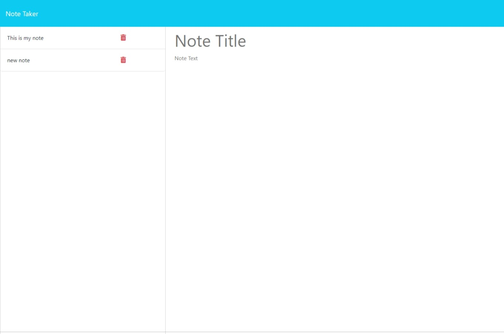
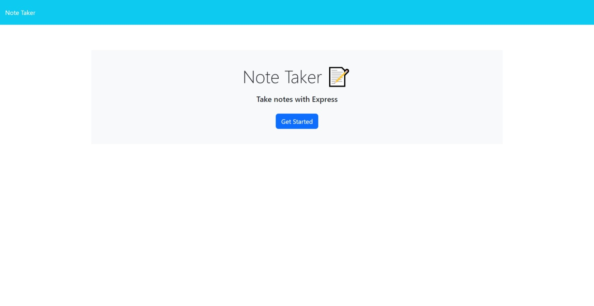

# Note Taker Application

## Description

The Note Taker application allows users to create, save, and delete notes in an organized manner. Users can easily manage their notes with a simple and intuitive interface.

## Features

Landing page with a link to the notes page
Notes page displaying existing notes and fields to create new notes
Save Note button to save new notes
Clear Form button to clear the new note form
Clicking on an existing note displays it in the right-hand column
New Note button to create a new empty note

## installation
npm i

## usage
npm start

## Technologies Used

Node.js
Express.js
HTML/CSS
JavaScript

## Link to deployed page 

https://note-taker-7d75.onrender.com

## Credits

This project was created by Matheus Almeida.

## License

This project is licensed under the MIT License.
